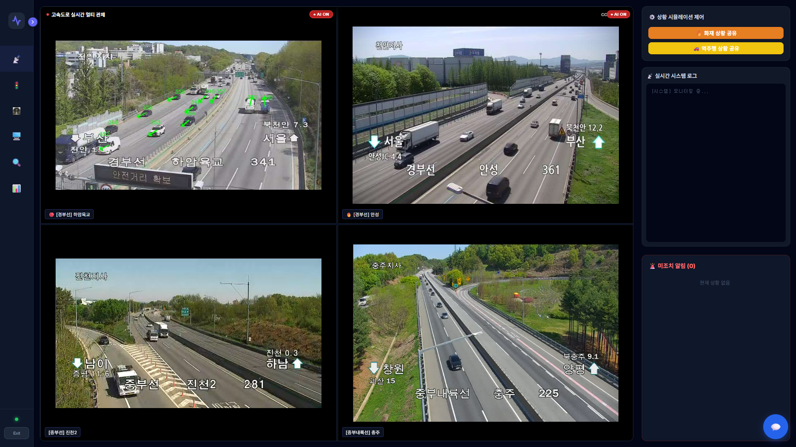
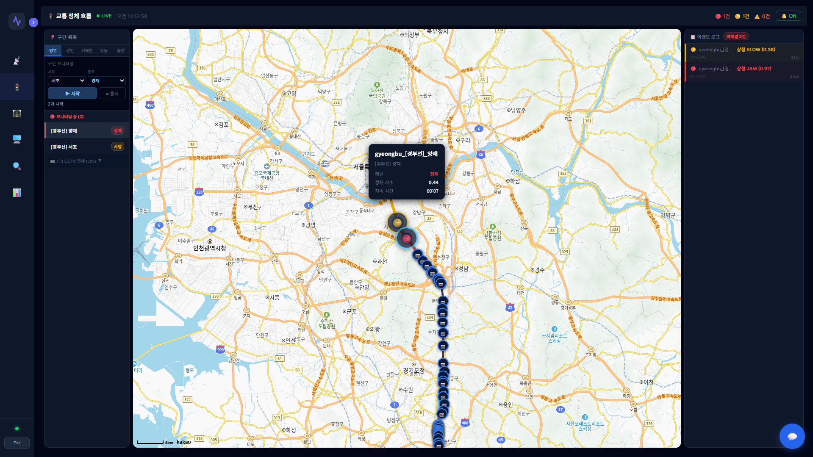
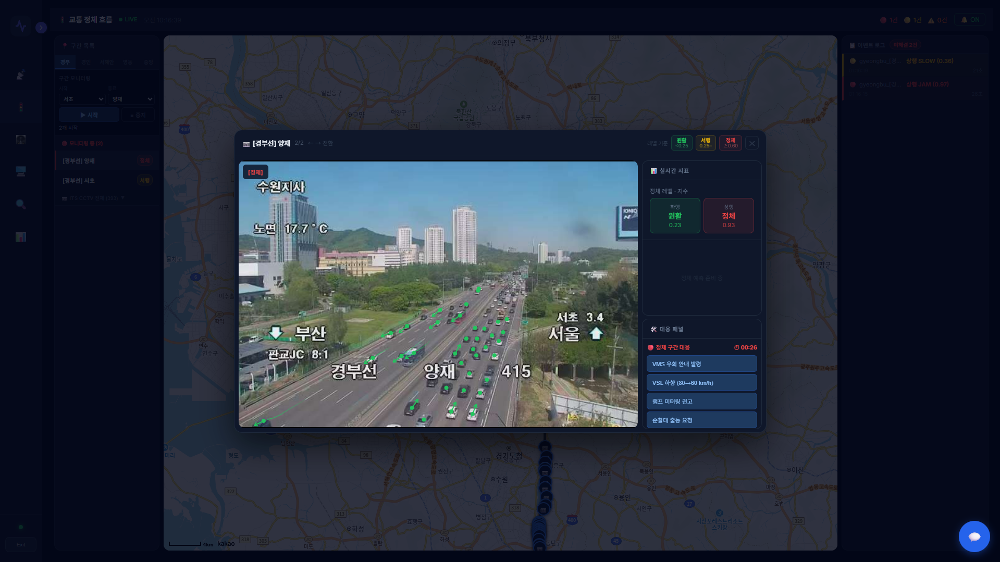
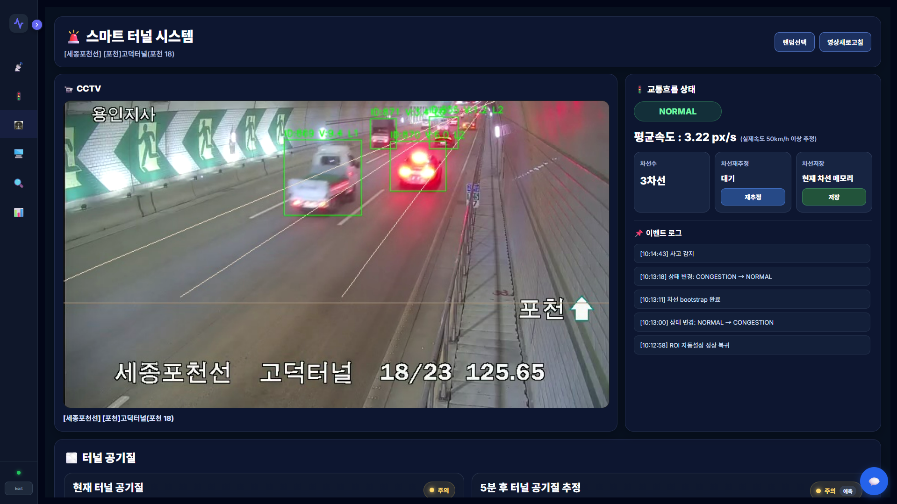
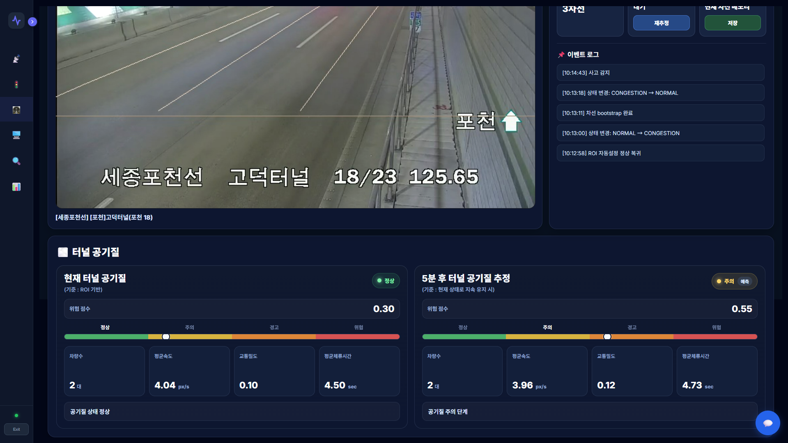
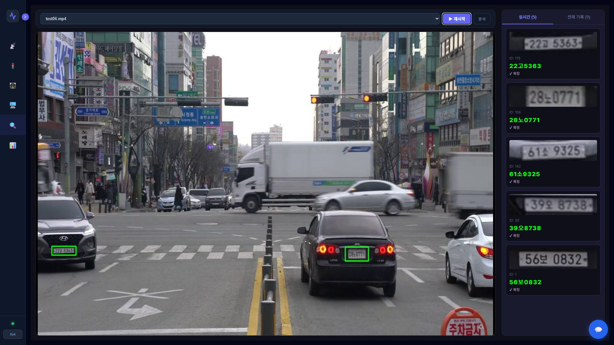
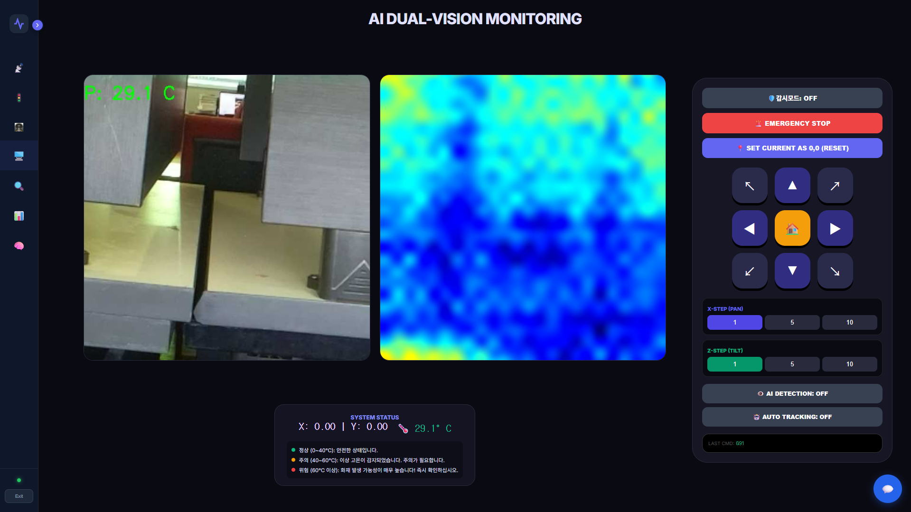
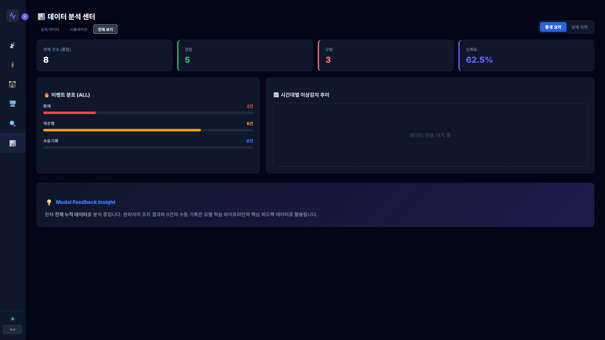
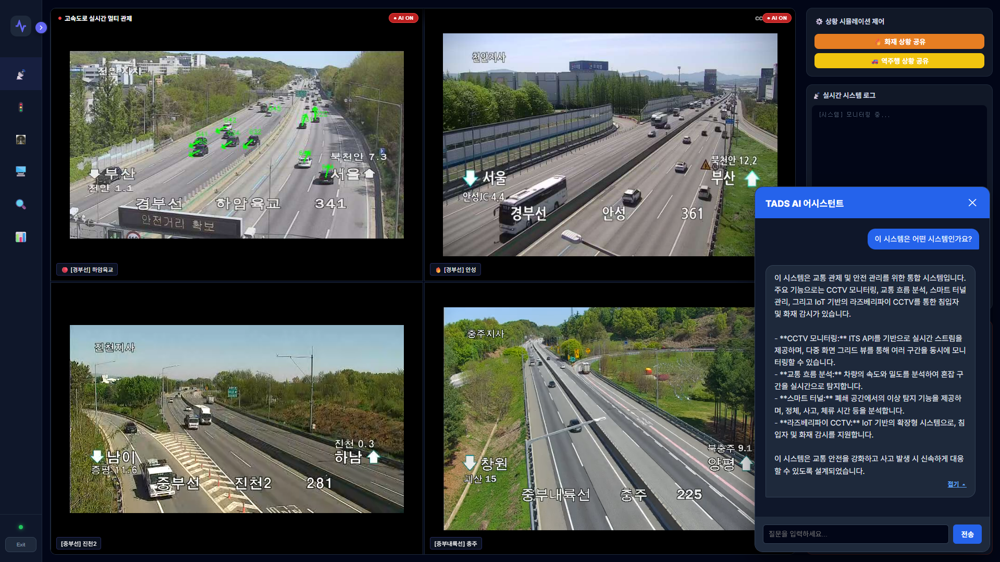

# 🚦 TADS: Traffic Anomaly Detection System

> **AI 기반 실시간 교통 이상 탐지 및 관제 시스템**
> 역주행/화재 탐지 + 교통 흐름 모니터링 + 번호판 인식 + 라즈베리파이 CCTV + AI AGENT

---

## 📚 Additional Documents

- 📘 [사용 가이드](./GUIDE.md)

---

## 🌐 Live Demo

* 🔗 http://tads.n-e.kr/
* 🔑 ID / PW: `test / test` (테스트용)

👉 실제 CCTV 기반 교통 이상 탐지 시스템을 웹에서 직접 확인할 수 있습니다.

---

## 📌 Overview

기존 교통 관제 시스템은 사람이 CCTV를 직접 모니터링해야 하기 때문에:

* ❌ 이상 상황 대응 지연
* ❌ 인력 의존적 운영
* ❌ 데이터 활용 한계

TADS는 이를 해결하기 위해:

> 🎯 **AI 기반 자동 탐지 + 실시간 웹 관제 + 데이터 분석**

을 통합한 **End-to-End 교통 AI 시스템**입니다.

👉 본 시스템은 실제 관제 환경을 반영하여
**기능별 AI 모듈을 웹 대시보드 탭 형태로 구성하였습니다.**

---

## 📸 Screenshots

### 📡 CCTV Monitoring



### 🚦 Traffic Flow Monitoring





### 🚇 Smart Tunnel





### 🔍 License Plate Recognition



### 📷 Raspberry Pi CCTV



### 📊 Statistics



### 👤 AI-AGENT



---

## 🖥️ System Modules (Dashboard Tabs)

### 📡 1. CCTV 모니터링

* ITS API 기반 실시간 CCTV 스트림 제공
* 다중 화면 동시 모니터링 (Grid View)
* 교통 상황 실시간 확인

👉 **실제 도로 관제 메인 화면**

---

### 🚦 2. 교통 흐름 모니터링

* 차량 속도 및 밀도 분석
* 혼잡 구간 실시간 탐지
* 교통 흐름 시각화

---

### 🚇 3. 스마트 터널 모니터링

* 터널 내 정체 / 급정거 / 사고 감지
* 차량 밀집도 및 체류시간 분석
* 폐쇄 공간 특화 이상 탐지

---

### 📷 4. 라즈베리파이 CCTV

* 저비용 DIY CCTV 시스템
* Pan/Tilt 자동 추적 기능
* 침입자 및 화재 감지

👉 **IoT 기반 확장형 CCTV 시스템**

---

### 🔍 5. 번호판 인식

* YOLOv11 기반 번호판 검출
* Custom OCR 모델 적용
* Voting 알고리즘 기반 최종 결과 도출

⚠️ 실제 CCTV 화질 한계로 인해
👉 **블랙박스 영상 기반 데모로 구성**

---

### 📊 6. 통계 데이터

* 이상 이벤트 실시간 집계
* 시간/위치 기반 분석
* 대시보드 시각화

---

## 🧠 Technical Challenges & Solutions

---

### 🚨 1. YOLO CPU 과부하 문제

**문제**

* AWS EC2 (GPU 없음) 환경에서 성능 저하
* 실시간 처리 불가능

**해결**

* OpenVINO 기반 모델 최적화
* YOLO 경량 모델 사용

**결과**

* CPU 환경에서도 실시간 처리 가능

---

### 💾 2. EC2 메모리 부족

**문제**

* YOLO + OCR 동시 실행 시 RAM 부족

**해결**

* Swap 메모리 4GB 확장

**결과**

* 서버 다운 방지 및 안정성 확보

---

### 🔍 3. OCR 정확도 문제

**문제**

* 프레임마다 번호판 인식 결과 불안정

**해결**

* 다중 프레임 결과를 누적하여
* **Voting 기반 최종 결과 결정**

**결과**

* 인식 정확도 향상 및 노이즈 감소

---

### ↩️ 4. 역주행 탐지 (핵심 기술)

**문제**

* CCTV마다 각도 상이
* 단순 방향 기준 적용 불가

**해결**

* FlowMap 기반 차량 이동 흐름 학습
* 정상 흐름 대비 방향 비교

**결과**

* 카메라 위치와 무관한 역주행 탐지

---

## 🏗️ System Architecture (Real-World Design)

본 시스템은 실제 환경의 제약을 고려하여
**다중 입력 기반 하이브리드 구조**로 설계되었습니다.

```
             ┌────────────────────────────┐
             │     ITS CCTV API (실시간)   │
             │   - 실제 도로 영상 스트림    │
             └─────────────┬──────────────┘
                           ↓
                    [Web Dashboard]
                           ↑
                           │
 ┌─────────────────────────┼─────────────────────────┐
 │                         │                         │
 ▼                         ▼                         ▼

[시뮬레이션 영상]     [블랙박스 영상]     [Raspberry Pi CCTV]
(역주행/화재 테스트)   (번호판 OCR)       (IoT 실시간 감시)

   ↓                       ↓                   ↓
[YOLO + Tracking]     [YOLO + OCR]     [Object Tracking]
   ↓                       ↓                   ↓
[이상 탐지 로직]        [Voting]        [Event Detection]
   ↓                       ↓                   ↓
   └──────────────→ [MySQL DB] ←──────────────┘
                           ↓
                    [Flask API]
                           ↓
                    [React Dashboard]

                           ↓
                ┌──────────────────────┐
                │  분석 및 응용 모듈    │
                ├──────────────────────┤
                │ • Traffic Flow 분석  │
                │ • Smart Tunnel 분석  │
                │ • 통계 / 리포트       │
                └──────────────────────┘
```

---

### 📌 설계 의도

* **ITS CCTV (실시간)**

  * 실제 도로 상황 모니터링
  * 관제 시스템 UI 제공

* **시뮬레이션 영상**

  * 역주행 / 화재 등 희귀 이벤트 테스트
  * 모델 검증 및 데모

* **블랙박스 영상**

  * 고화질 번호판 인식
  * OCR 정확도 확보

* **Raspberry Pi CCTV**

  * 저비용 IoT 확장형 감시 시스템

👉 즉, 본 시스템은

> ❗ **“실제 환경 + 테스트 환경을 분리한 현실적인 AI 시스템”**

으로 설계되었습니다.

---

## 🛠️ Tech Stack

### AI / ML

* YOLOv8, YOLOv11
* ByteTrack
* OpenVINO
* Custom OCR
* FlowMap

### Backend

* Flask
* Socket.IO
* MySQL
* SQLAlchemy

### Frontend

* React
* Vite
* Chart.js
* Hls.js
* Kakao Maps

### Infra

* Docker
* AWS EC2
* RDS
* Nginx
* GitHub Actions

---

## ⚙️ Performance

| 항목     | 내용            |
| ------ | ------------- |
| 탐지 정확도 | 94.2% mAP     |
| 지연 시간  | 약 0.8초        |
| 운영 환경  | AWS EC2 (CPU) |
| 최적화    | OpenVINO      |
| 안정성    | Swap 4GB      |

---

## 🚀 What Makes This Project Different

이 프로젝트는 단순한 AI 모델 구현이 아니라:

> ❗ **실제 배포 환경에서 동작하는 통합 관제 시스템**

* YOLO + Tracking + Flow 분석 통합
* CPU 환경 최적화
* 웹 기반 실시간 관제 시스템
* AI + Backend + Frontend + Infra 통합 경험

👉 **실무형 AI 시스템 설계 및 운영 경험을 보여주는 프로젝트**

---

## 📌 Future Work

* GPU 기반 성능 확장
* 실시간 알림 시스템
* 지도 기반 시각화 고도화
* 이상 상황 분류 모델 개선

---

## 🧑‍💻 Author

* Traffic Anomaly Detection System (TADS)


